# Securing AI on Kubernetes: Your Pods Are Gossiping Behind Your Back

Every team is shipping AI on Kubernetes now — RAG pipelines, fine-tuning jobs, model serving at scale. But while everyone's racing to deploy, almost nobody is asking: *"Who can talk to my vector database?"* In a world where your embeddings ARE your competitive moat, network-level security isn't optional — it's existential.

Throughout this post, we'll use a typical three-tier RAG application as our running example — a **Chat UI** (Next.js) where users submit prompts, a **RAG API** (FastAPI) that retrieves context from embeddings and calls an external LLM provider like OpenAI, and a **Vector DB** (Qdrant) that stores your proprietary embeddings. It's a stack you'll find in production at countless AI startups — and it's wide open by default.

That **vector database** storing your proprietary embeddings? It can freely call your **public-facing chat interface**. Nobody configured that. Nobody asked for that. It just happens — because in Kubernetes, the default networking model has the security posture of a coffee shop WiFi.

Every pod can talk to every other pod. Every namespace. Every port. That AI inference pipeline you spent weeks designing? Kubernetes treats it as a polite suggestion.

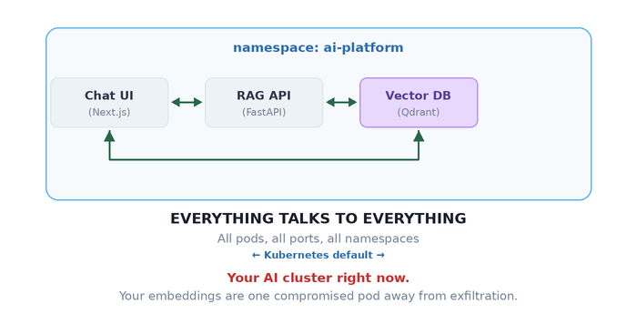

Your architecture diagram has clean, directional arrows. Your actual network? It's a group chat where everyone can DM everyone — including your vector database leaking proprietary embeddings to your public-facing chat endpoint.

Let's fix that.

---

## The One Rule That Changes Everything

Here's the thing about Kubernetes NetworkPolicy that trips up even experienced engineers: it doesn't work like a traditional firewall. There's no "deny" rule. There's no ordering. There's just one rule:

> **The moment a pod is selected by ANY NetworkPolicy, all traffic not explicitly allowed becomes denied.**

No NetworkPolicy on a pod? Wide open. Apply *one* policy? Immediate lockdown. Only traffic matching your rules gets through. Everything else hits a wall.

It's like living in a building with no front door versus one with a bouncer. There's no middle ground — it's either "anyone walks in" or "name on the list, or you're not getting in."

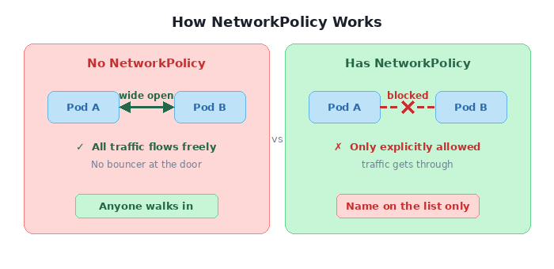

This is powerful. And it's also where you'll shoot yourself in the foot if you're not careful.

---

## Locking Down a Real App, One Door at a Time

Theory is nice. Let's break things and fix them with our RAG stack. The goal:

```
   What we WANT:        Chat UI ───► RAG API ───► Vector DB
                        (one-way chain — prompts flow in, context flows back)

   What we HAVE:        Chat UI ◄──► RAG API ◄──► Vector DB ◄──► Chat UI
                        (everyone talks to everyone, your embeddings are exposed)
```

Three policies. Three YAML files. That's all it takes to go from "anyone can exfiltrate your training data" to "zero-trust RAG pipeline."

### Step 1 — Shut everything down

```yaml
apiVersion: networking.k8s.io/v1
kind: NetworkPolicy
metadata:
  name: deny-all
  namespace: ai-platform
spec:
  podSelector: {}      # every pod in the namespace
  policyTypes:
  - Ingress            # + no ingress rules = nothing gets in
```

Two things are doing the heavy lifting here. `podSelector: {}` — the empty selector — targets **every** pod in the namespace. And `policyTypes: [Ingress]` without any `ingress` rules is an explicit "deny all." Run the connectivity test now:

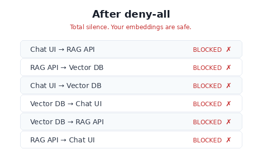

Good. Everything's broken. That's exactly where we want to start.

### Step 2 — Open exactly two doors

Now we surgically allow **only** the paths that should exist.

```yaml
# Let Chat UI call RAG API (and nothing else)
spec:
  podSelector:                    # WHO receives traffic:
    matchLabels:                  #   → the RAG API
      app: rag-api
  ingress:
  - from:
    - podSelector:                # WHO sends traffic:
        matchLabels:              #   → the chat UI
          app: chat-ui
    ports:
    - port: 8000                  # on the FastAPI port only
```

```yaml
# Let RAG API call Vector DB (and nothing else)
spec:
  podSelector:                    # WHO receives traffic:
    matchLabels:                  #   → the vector database
      app: vector-db
  ingress:
  - from:
    - podSelector:                # WHO sends traffic:
        matchLabels:              #   → the RAG API
          app: rag-api
    ports:
    - port: 6333                  # Qdrant REST API port
    - port: 6334                  # Qdrant gRPC port (if using gRPC client)
```

The YAML reads like a sentence: *"The RAG API accepts ingress from the chat UI on port 8000."* That's it. Nothing about the vector DB reaching the UI, nothing about random pods querying your embeddings. Every path not mentioned is dead.

> **Note:** NetworkPolicy controls *new* connections, not return traffic. When Chat UI calls RAG API, the HTTP response flows back over the same established TCP connection — that's allowed. What's blocked is RAG API *initiating* a new connection to Chat UI.

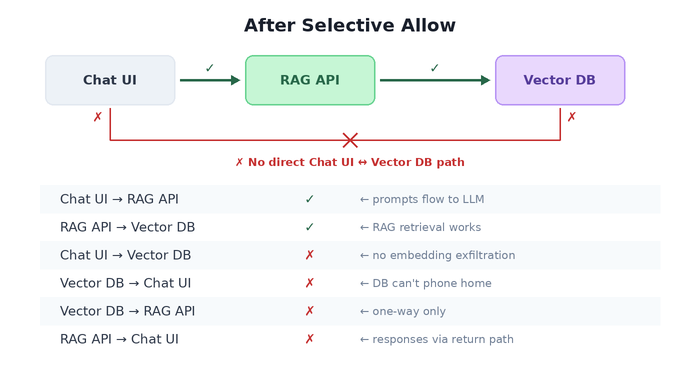

Three policy files. Your architecture diagram and your actual network now match. That's the whole point of NetworkPolicy — making reality agree with the whiteboard.

### Step 3 — Crossing the namespace border

Your ML ops stack (model monitoring, drift detection, evaluation pipelines) lives in a separate namespace. It needs to query your RAG API for health checks and metrics. How do you let traffic cross namespace boundaries without opening the floodgates?

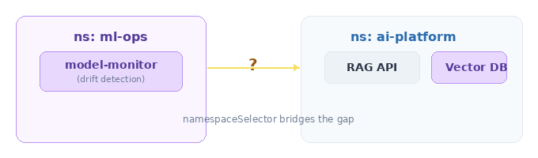

The answer: `namespaceSelector`. It's like a VIP pass, but for entire namespaces.

```yaml
spec:
  podSelector: {}                  # all pods in ai-platform
  ingress:
  - from:
    - namespaceSelector:
        matchLabels:
          purpose: ml-ops          # ← the namespace itself needs this label
```

The namespace must be labeled — that's your access control surface:

```yaml
apiVersion: v1
kind: Namespace
metadata:
  name: ml-ops
  labels:
    purpose: ml-ops                # no label, no entry
```

This reads: *"Any pod from any namespace labeled `purpose: ml-ops` can reach any pod in ai-platform."* Not any pod from anywhere. Not any namespace. Just the one with the right badge.

---

## 8 Policies That Look Identical and Do Completely Different Things

Here's where NetworkPolicy goes from "I get it" to "I need to lie down."

I'm about to show you 8 policy snippets. Some differ by a single YAML line. Some differ by *the presence or absence of a dash*. The behavioral differences are enormous. This is the section you'll wish you'd read before that 2 AM incident.

### The Scoreboard

Before we dive into each, here's what they all do. Stare at this table. Notice how rows 5 and 6 — which look almost identical — produce the same result for the wrong reasons. Notice how row 3 and 4 differ by one word.

| # | Name | The `from` Spec | Same NS | Cross NS | External |
|---|------|-----------------|:-------:|:--------:|:--------:|
| 1 | Allow All | `ingress: [{}]` | ✅ | ✅ | ✅ |
| 2 | Deny All | *(no ingress key)* | ❌ | ❌ | ❌ |
| 3 | Same NS Only | `podSelector: {}` | ✅ | ❌ | ❌ |
| 4 | Cluster Internal | `namespaceSelector: {}` | ✅ | ✅ | ❌ |
| 5 | AND Trap ⚠️ | `podSelector: {}` + `namespaceSelector: {}` *(same item)* | ✅ | ✅ | ❌ |
| 6 | OR Logic | `podSelector: {}` + `namespaceSelector: {}` *(separate items)* | ✅ | ✅ | ❌ |
| 7 | Specific NS | `namespaceSelector: {matchLabels}` | ❌ | ✅ ml-ops only | ❌ |
| 8 | Specific Pod+NS | `namespaceSelector + podSelector` *(same item, with labels)* | ❌ | ✅ model-monitor only | ❌ |

Now let's look at *why*.

---

### 🔍 Spot the Difference #1: Allow All vs. Deny All

These two policies are identical except for **one line**. The result is the exact opposite.

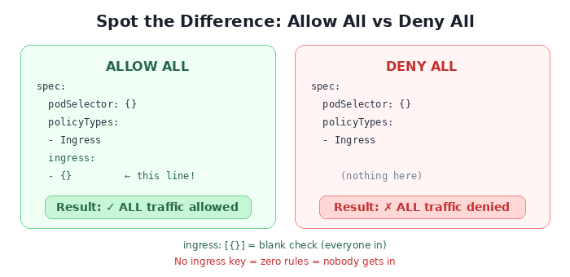

`ingress: [{}]` is a rule that says "from: anywhere, on: any port." It's a blank check. No `ingress` key at all means "there are zero rules" — and zero rules means zero allowed traffic.

> **The mental model:** `- {}` is a guest list that says "everybody." No list at all means nobody gets in.

---

### 🔍 Spot the Difference #2: podSelector vs. namespaceSelector

One word changes the blast radius from "this room" to "the entire building."

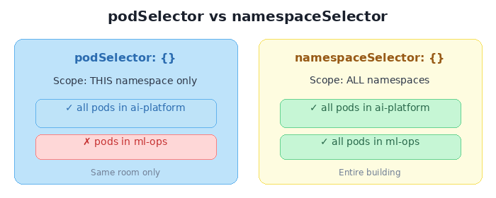

`podSelector: {}` means "all pods" — but implicitly scoped to the policy's own namespace. `namespaceSelector: {}` means "all namespaces" — which includes every pod in the cluster.

Same shape. Same empty `{}`. Wildly different doors you just opened.

---

### 🔍 Spot the Difference #3: AND vs. OR — The Hyphen Trap

**This is the single most dangerous subtlety in all of Kubernetes networking.** Two policies that look *nearly identical* — but one has an extra hyphen, and that hyphen decides whether your security posture is "surgical" or "wide open."

```
  AND LOGIC (one dash)                OR LOGIC (two dashes)
  ─────────────────────               ─────────────────────

  ingress:                            ingress:
  - from:                             - from:
    - podSelector: {}                   - podSelector: {}
      namespaceSelector: {}             - namespaceSelector: {}
                                        ▲
                                        │
                                   extra dash
```

**One YAML array item** = one rule where both conditions must match (AND).
**Two YAML array items** = two independent rules where either can match (OR).

When both selectors are `{}` (empty), it's a trick question — both produce the same result because "all pods AND all namespaces" equals "all pods OR all namespaces." But add real labels, and the trap snaps shut:

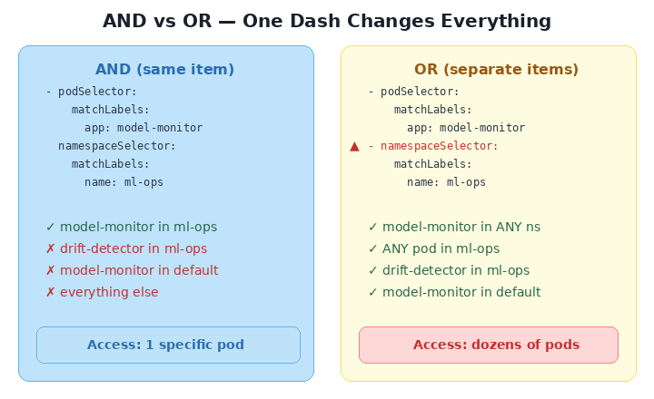

Read that again. The AND version allows exactly **one pod** (model-monitor, in ml-ops). The OR version allows **every pod in the ml-ops namespace** plus **every model-monitor pod in every namespace**. One extra `-` in your YAML, and you've opened a door you didn't know existed.

> **The rule to memorize:**
>
> One `-` = AND. Both must match.
> Two `-` = OR. Either can match.
>
> A single hyphen changes your entire security posture.

---

### 🔍 Spot the Difference #4: Namespace vs. Specific Pod

The final two scenarios show the spectrum from "everyone in this department" to "only this one person."

```
  SPECIFIC NAMESPACE                  SPECIFIC POD IN NAMESPACE
  ─────────────────────               ─────────────────────

  - namespaceSelector:                - namespaceSelector:
      matchLabels:                        matchLabels:
        name: ml-ops                        name: ml-ops
                                        podSelector:           ◄── added
                                          matchLabels:
                                            app: model-monitor

  Allowed:                            Allowed:
  ✅ model-monitor (ml-ops)           ✅ model-monitor (ml-ops)
  ✅ drift-detector (ml-ops)          ❌ drift-detector (ml-ops)
  ❌ pods from other ns              ❌ pods from other ns
```

Scenario 7 is a namespace-level badge: "anyone from ml-ops can enter." Scenario 8 adds a photo ID check: "only model-monitor from ml-ops." Both use the same AND logic from the trap above — but here it's intentional. The `namespaceSelector` and `podSelector` sit in the same `from` entry, so both must match.

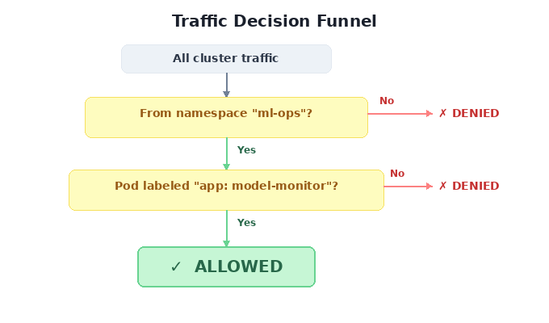

This is AND logic *used right* — a precision instrument, not a footgun.

---

## The Trap Nobody Warns You About: Egress and DNS

You've locked down ingress. You're feeling smart. So you think: *"Let me lock down egress too — deny all outbound traffic."*

```yaml
spec:
  podSelector: {}
  policyTypes:
  - Egress
  # no egress rules = pods can't call anything
```

Congratulations. Your pods are now so secure they can't resolve hostnames.

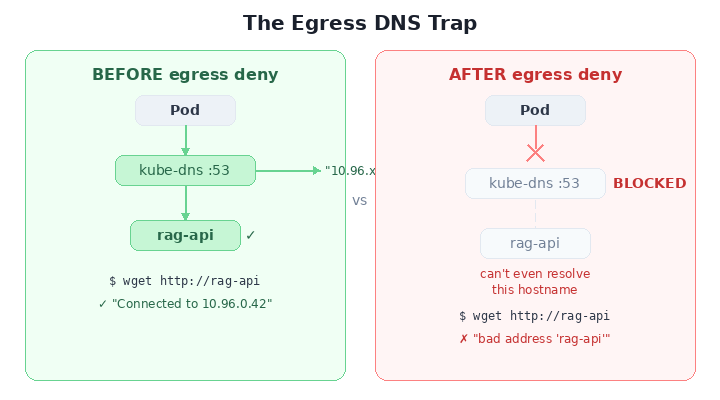

DNS runs on UDP/TCP port 53, served by `kube-dns` pods in `kube-system`. Deny all egress? You just cut off DNS. Every service name becomes unresolvable. Your pods aren't just isolated — they're blind.

**The fix — always pair egress deny with a DNS escape hatch:**

```yaml
spec:
  podSelector: {}
  policyTypes:
  - Egress
  egress:
  - to:
    - namespaceSelector:
        matchLabels:
          kubernetes.io/metadata.name: kube-system
      podSelector:
        matchLabels:
          k8s-app: kube-dns
    ports:
    - protocol: UDP
      port: 53
    - protocol: TCP
      port: 53
```

> **Burn this into memory:** Every egress deny needs a DNS allow. No exceptions. Ever. Put it in your template. Put it in your CI. Tattoo it on your forearm.

---

## The Mental Model You Actually Need

Forget everything else. If you internalize one diagram from this entire post, make it this one:

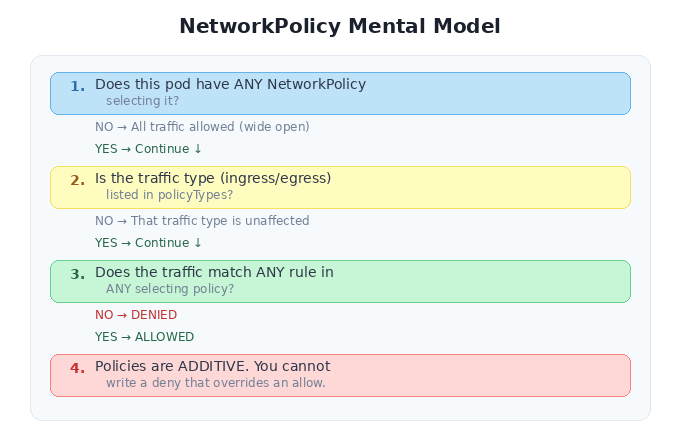

That last point is subtle and important: you can't write a "deny" policy that overrides an "allow" from another policy. Policies are additive. If Policy A allows traffic from namespace X, and Policy B tries to be more restrictive, Policy A still wins. The union of all rules is what gets enforced.

---

## The Cheat Sheet

Tear this out. Pin it next to your terminal.

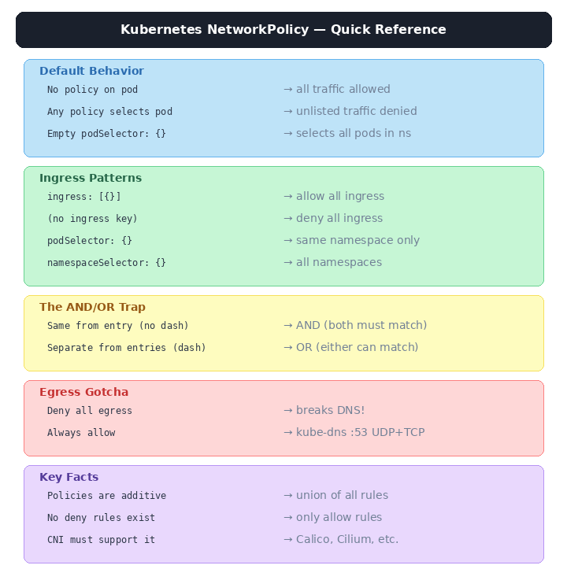

---

## Break Things Yourself

Here's a complete lab you can run on your laptop in under five minutes using [Kind](https://kind.sigs.k8s.io/), [kubectl](https://kubernetes.io/docs/tasks/tools/), and [Docker](https://docs.docker.com/get-docker/):

```bash
# Create a cluster with Calico (a CNI that actually enforces NetworkPolicy)
./scripts/setup.sh

# Deploy the RAG app — Chat UI, RAG API, Vector DB
kubectl apply -f manifests/

# Prove everything is wide open (your embeddings are one curl away)
./scripts/test-connectivity.sh

# Lock it down, then open surgical paths
kubectl apply -f policies/01-deny-all.yaml
kubectl apply -f policies/02-allow-ui-to-api.yaml
kubectl apply -f policies/03-allow-api-to-db.yaml
./scripts/test-connectivity.sh

# Run all 8 edge-case scenarios — see the AND/OR trap live
kubectl apply -f manifests/edge-cases-setup.yaml
./scripts/test-edge-cases.sh
# Check all policies in policies/edge-cases. Apply each edge-case policy one at a time. Run the test script after each one. Watch the connectivity matrix shift. The "aha" moment when you see a single hyphen change the results is worth more than reading this post ten times.

# Clean up
./scripts/teardown.sh
```

---

## One Last Thing

Kubernetes networking is opt-in security. Nobody forces you to write NetworkPolicies. Your cluster will run perfectly fine without them — in the same way your AI platform works perfectly fine without access controls.

Until someone exfiltrates your embeddings, poisons your training pipeline, or routes prompts through a compromised pod.

The YAML is five lines. The blast radius of not writing it is your entire model stack. That's the trade-off, and it's not even close.

Ship the policy before you ship the model.

---

**Tags:** `kubernetes` `network-policy` `ai-security` `zero-trust` `cloud-native` `mlops` `devsecops` `container-security` `llm-infrastructure`
